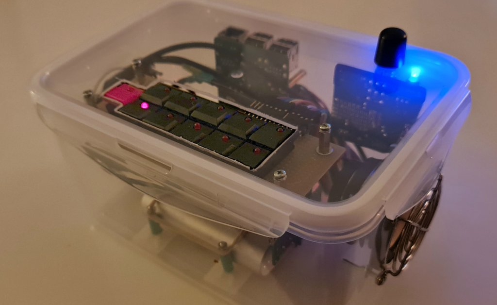
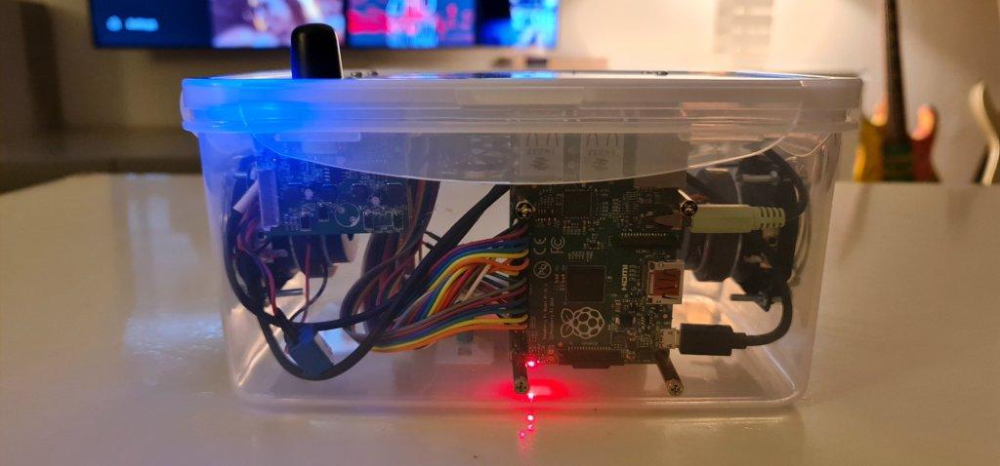

# Toddler Music Player

**A music player for toddlers**

> The simplest user interface. Just press a button to listen a song.



## Hardware

1. Raspberry PI 1 B+ (v1.2)
2. Speakers USB powered
3. Powerbank with 2 outputs
4. Buttons with Leds (11)
5. Resistors 330 (11)
6. Box

## Software

1. DietPi for armv6l
2. MPD
3. Toddler Music Player


## 1. DietPi

OS Config

```bash
systemctl disable dietpi-postboot # fast boot
```

Packages

```bash
apt install build-essential python-dev python3.9-dev python-pip python3-pip

apt install vim git mpd mpc       # nothing works without vim
apt install openssh-sftp-server   # for trasnfering songs

export CFLAGS=-fcommon;
pip3 install RPi.GPIO             # python access gpio pins
```

Test

```bash
alsamixer
speaker-test
aplay aplay /var/lib/mpd/music/Dj_Goja_-_Cause_Im_Crazy.mp3
```

## 2. MPD

Install

```bash
apt install mpd
```

Configure

> :floppy_disk:  `/etc/mpd.conf`

```json
music_directory      "/var/lib/mpd/music"
playlist_directory   "/var/lib/mpd/playlists"
db_file              "/var/lib/mpd/tag_cache"
log_file             "/var/log/mpd/mpd.log"
pid_file             "/run/mpd/pid"
state_file           "/var/lib/mpd/state"
sticker_file         "/var/lib/mpd/sticker.sql"
user                 "mpd"
bind_to_address      "localhost"
input {
        plugin       "curl"
}
decoder {
        plugin       "hybrid_dsd"
        enabled      "no"
}
decoder {
        plugin       "wildmidi"
        enabled      "no"
        #config_file "/etc/timidity/timidity.cfg"
}
audio_output {
	type             "alsa"
	name             "My ALSA Device"
	device           "hw:0,0"
	mixer_control    "Headphone"
}
filesystem_charset "UTF-8"
ixer_control       "Headphone"
}
```

Enable

```bash
systemctl status mpd
systemctl start mpd
systemctl enable mpd
```

Test MPD

```bash
# create playlist
ls -1 /var/lib/mpd/music/*.mp3 > /var/lib/mpd/playlists/main.m3u

# test playlist
mpc load main
mpc play
```

## 3. Toddler Music Player

Install
```bash
git clone https://github.com/vaidis/Toddler-Music-Player.git
mkdir /opt/tmplayer
cp Toddler-Music-Player/tmplayer.py /opt/tmplayer.py
chmod +x /opt/tmplayer.py
```

Startup

> :floppy_disk:  `/etc/systemd/system/tmplayer.service`

```bash
[Unit]
Description=TMPlayer
ConditionPathExists=/opt/tmplayer.py

[Service]
Type=forking
ExecStart=/opt/tmplayer.py
TimeoutSec=0
StandardOutput=tty
RemainAfterExit=yes
SysVStartPriority=99

[Install]
WantedBy=multi-user.target
EOF
```

Enable

```bash
systemctl daemon-reload
systemctl status tmplayer
systemctl start tmplayer
systemctl enable tmplayer
```

